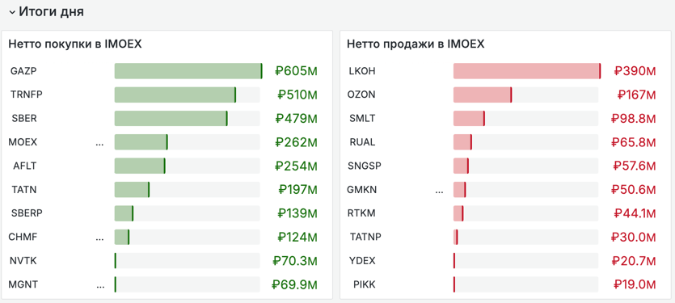
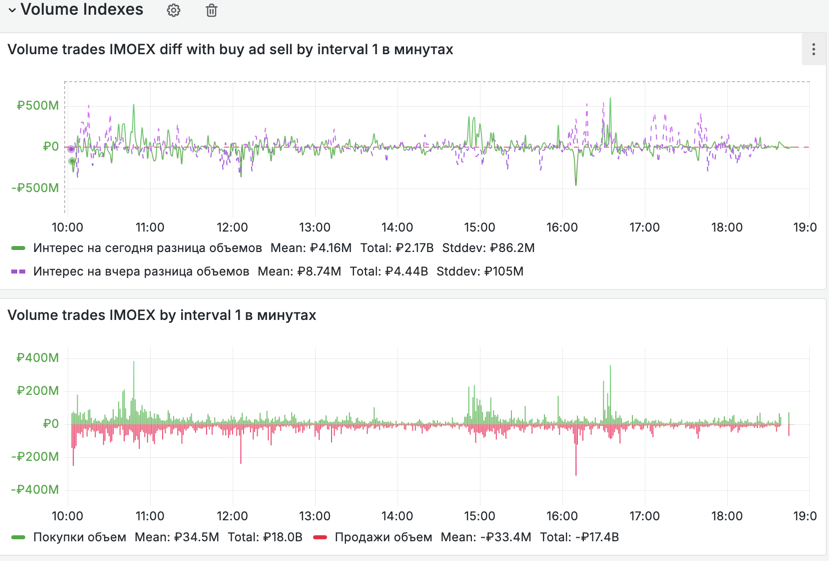

# Transaq Clickhouse Exporter

## Description

gRPC клиент от [txmlconnector`а](https://github.com/kmlebedev/txmlconnector) для экспорта данных торгов ММВБ в базу данных [ClickHouse](https://clickhouse.com/)

## Переподключение

Экспортёр автоматически восстанавливает соединение и подписки:

- при статусе терминала `connected=false` или `connected=error` повторяет команду `connect`;
- при завершении gRPC response stream закрывает старую сессию и создаёт новый `TCClient` с экспоненциальной задержкой от 1 до 30 секунд;
- после нового статуса `connected=true` заново формирует и отправляет подписки без накопления дубликатов.

Интервал повторного подключения к терминалу задаётся переменной `TC_RECONNECT_INTERVAL` в формате Go duration (например, `5s` или `1m`). Значение по умолчанию — `5s`.
